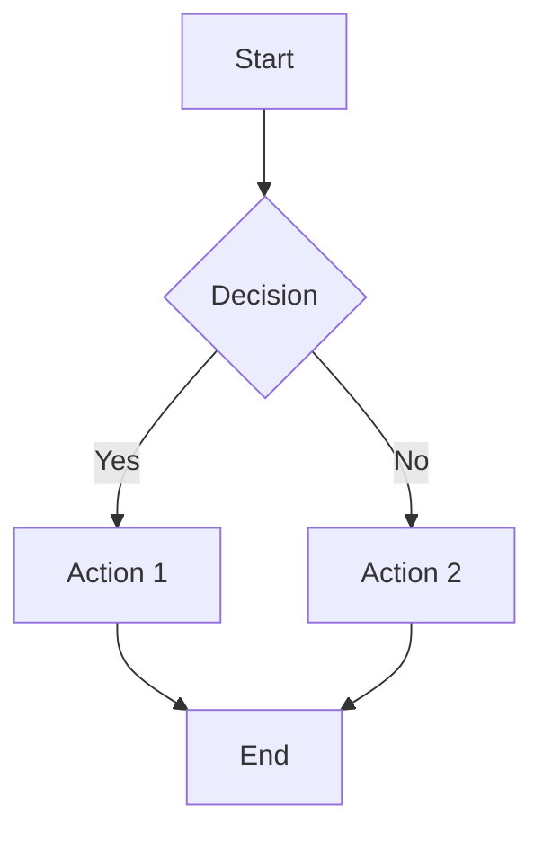

# 📚 Blog Enhancement Features - Quick Reference

## 🎯 What's New

Your blog now supports advanced educational content creation with professional styling and interactive elements!

## 🛠️ Template System

In your blog editor, click the new **"Insert Template"** button to access:

### 📖 Code Walkthrough Template
Perfect for explaining complex code step-by-step:
```html
<div class="code-walkthrough">
    <div class="code-step">
        <div class="code-step-number">1</div>
        <h4>Step Title</h4>
        <div class="code-annotation">
            <p>Explanation of what's happening</p>
        </div>
    </div>
</div>
```

### 🆚 Comparison Template
Show before/after or different approaches:
```html
<div class="code-comparison">
    <div class="code-comparison-section code-comparison-before">
        <div class="code-comparison-header">❌ Before</div>
        <pre><code>Old code here</code></pre>
    </div>
    <div class="code-comparison-section code-comparison-after">
        <div class="code-comparison-header">✅ After</div>
        <pre><code>Improved code here</code></pre>
    </div>
</div>
```

### 🏗️ Architecture Diagram
Visual system representations:
```html
<div class="architecture-diagram">
    <div class="arch-component">
        <h4>Component Name</h4>
        <p>Description</p>
    </div>
    <div class="arch-arrow">→</div>
    <div class="arch-component">
        <h4>Next Component</h4>
        <p>Description</p>
    </div>
</div>
```

### 🏆 Challenge Template
Interactive reader challenges:
```html
<div class="callout callout-warning">
    <div class="callout-title">🏆 Your Turn: Challenge Name</div>
    <div class="callout-content">
        <p><strong>Your Mission:</strong> What they should do</p>
        <h4>📝 Instructions:</h4>
        <ol>
            <li>Step 1</li>
            <li>Step 2</li>
        </ol>
    </div>
</div>
```

## 🎨 Visual Elements

### Callouts & Highlights
```html
<!-- Info callout -->
<div class="callout callout-info">
    <div class="callout-title">💡 Pro Tip</div>
    <div class="callout-content">
        <p>Your helpful information</p>
    </div>
</div>

<!-- Warning callout -->
<div class="callout callout-warning">
    <div class="callout-title">⚠️ Important</div>
    <div class="callout-content">
        <p>Warning information</p>
    </div>
</div>

<!-- Success callout -->
<div class="callout callout-success">
    <div class="callout-title">✅ Success</div>
    <div class="callout-content">
        <p>Success message</p>
    </div>
</div>

<!-- Error/danger callout -->
<div class="callout callout-error">
    <div class="callout-title">❌ Error</div>
    <div class="callout-content">
        <p>Error information</p>
    </div>
</div>

<!-- Visual highlight box -->
<div class="visual-highlight">
    <h2>🎓 What You'll Learn</h2>
    <p><strong>By the end:</strong> You'll be able to...</p>
</div>
```

### Code Blocks with Filenames
```html
<div class="code-block-with-filename">
    <div class="code-filename">app.py</div>
    <pre><code class="language-python">
# Your code here
    </code></pre>
</div>
```

### Metrics Grid
```html
<div class="metrics-grid">
    <div class="metric-card">
        <span class="metric-value">95%</span>
        <div class="metric-label">Performance Boost</div>
    </div>
    <div class="metric-card">
        <span class="metric-value">50ms</span>
        <div class="metric-label">Load Time</div>
    </div>
</div>
```

### Timeline
```html
<div class="timeline">
    <div class="timeline-item">
        <div class="timeline-step">STEP 1</div>
        <h4>Phase Title</h4>
        <p>Description of what happens</p>
    </div>
    <div class="timeline-item">
        <div class="timeline-step">STEP 2</div>
        <h4>Next Phase</h4>
        <p>Next description</p>
    </div>
</div>
```

## 📊 Mermaid Diagrams

Add interactive diagrams with:
```markdown

```

Supported diagram types:
- **Flowcharts**: Process flows and decision trees
- **Sequence diagrams**: API interactions and workflows  
- **Class diagrams**: Software architecture
- **Gantt charts**: Project timelines
- **Git graphs**: Repository workflows

## 🔗 Series Navigation

For multi-part content, use the series navigation component:

```html

```

## 🚀 Best Practices

### 1. Content Structure
- Start with a visual highlight summarizing what readers will learn
- Use step-by-step walkthroughs for complex processes
- Include challenges to make content interactive
- End with clear next steps

### 2. Visual Hierarchy
- Use callouts to highlight important information
- Break up long code blocks with annotations
- Include diagrams for complex concepts
- Use comparison layouts to show improvements

### 3. Educational Flow
- Begin with context (why this matters)
- Show examples before explaining theory
- Provide hands-on practice opportunities
- Summarize key takeaways

### 4. Code Presentation
- Always include filename context
- Add line-by-line annotations for complex code
- Show before/after comparisons
- Highlight key changes visually

## 📖 Example Usage

Check out `example-enhanced-article.md` for a complete article using all these features!

---

Ready to create amazing educational content? Open your blog editor and start with the templates! 🎉
